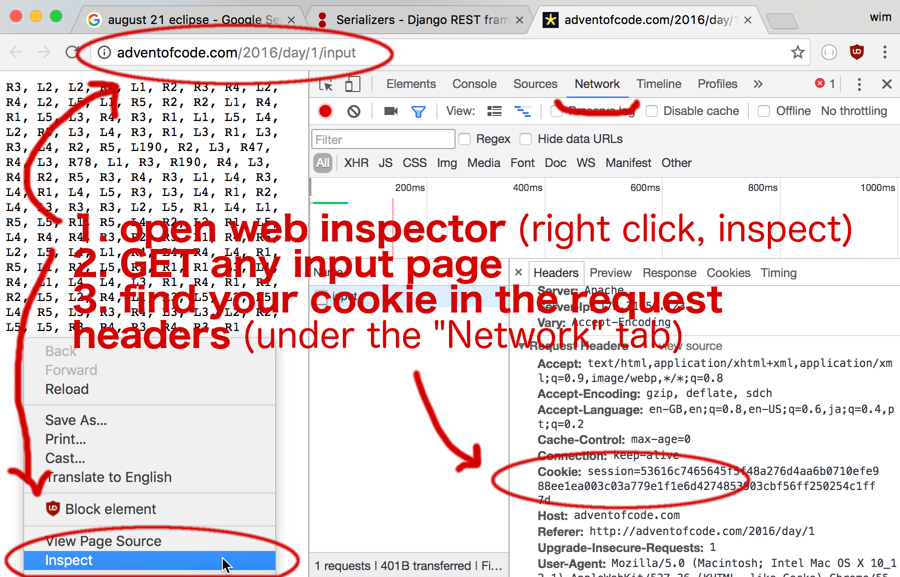

# Challenges from Advent of Code

You can find all challenges [here](https://adventofcode.com/).

To setup python env:
- run `pip install -r requirements.txt`
- get your aoc session (see how to [here](https://github.com/wimglenn/advent-of-code-wim/issues/1)
- save your session as plaintext at `~/.config/aocd/token`
- run any py

Feel free to reuse this code =)
